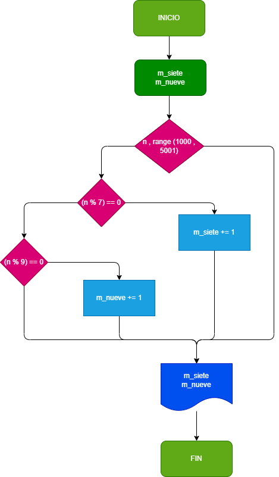

# EJERCICIO N°2

Hacer el diagrama de flujo y programa que averigue e imprima cuantos multiplos de 7 y cuantos de 9 cuantoas numeros hay comprendidos entre el 1000 y el 5000.

# Diagrama de flujo 

